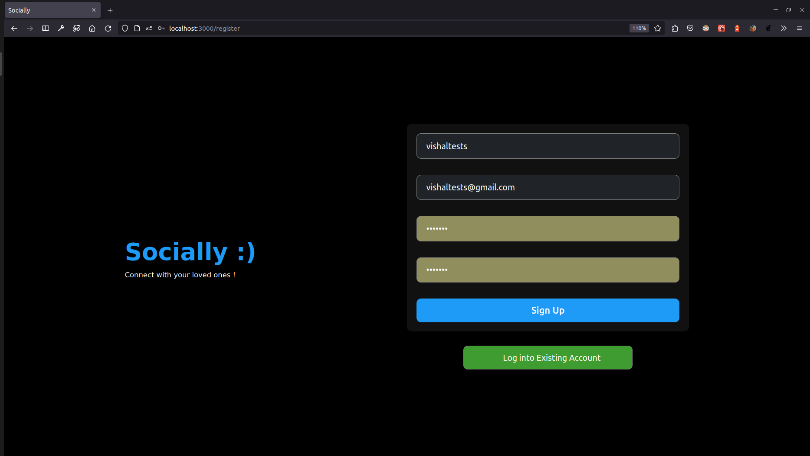
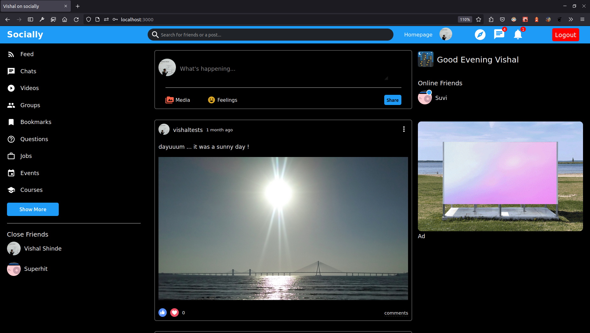
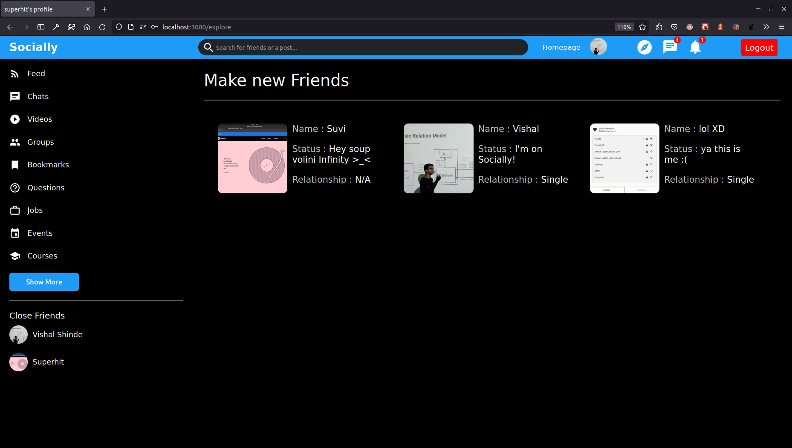
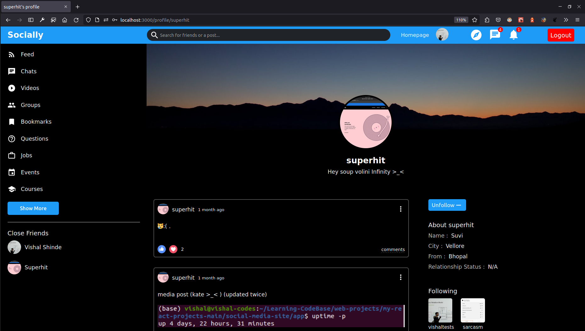
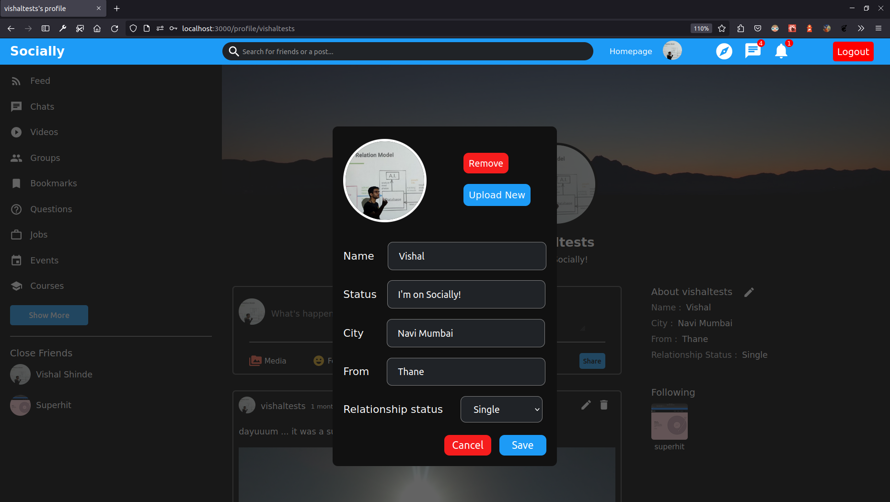

# Socially
Hey👋 there, welcome to socially's codebase. Socially is a social media website built using MERN (MongoDb, Express.js, React.js, Node.js) stack. User's can register themselves with their email and make new friends by surfing on the discover page. A user can add, edit and delete their posts. A users feed consists of posts posted by accounts which the repective user follows. I have built this project to practice and improve my full stack web development skills. Here are the screenshots of the project -

Register Page

 

My Feed

 

Discover Page

 

One Of my friend's Profile Page

 

Editing my Profile Info

